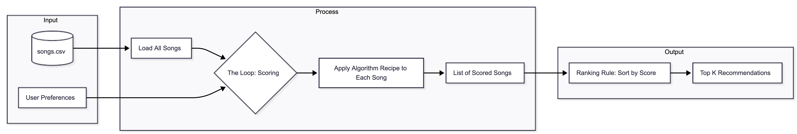
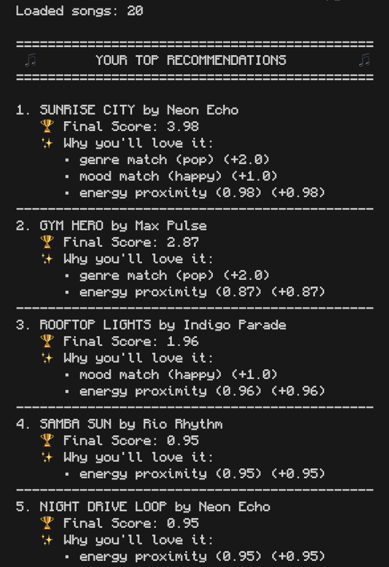
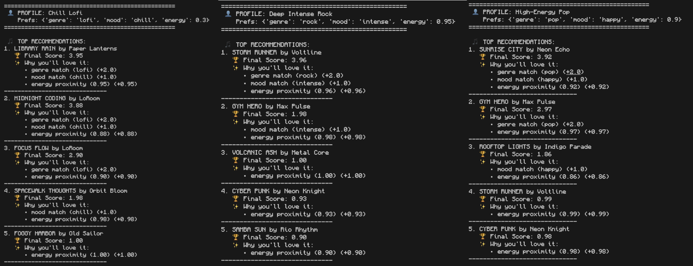
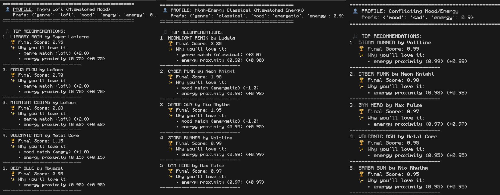

# 🎵 Music Recommender Simulation

## Project Summary

In this project you will build and explain a small music recommender system.

Your goal is to:

- Represent songs and a user "taste profile" as data
- Design a scoring rule that turns that data into recommendations
- Evaluate what your system gets right and wrong
- Reflect on how this mirrors real world AI recommenders

This version of the music recommender uses a **content-based filtering** approach to match songs to a user's taste profile. It simulates how real-world platforms use song metadata (like acoustic features and genre tags) to predict what a user will enjoy. My system prioritizes genre consistency as the primary filter while using numerical proximity to fine-tune recommendations based on the user's desired energy level and acoustic preferences.

---

## How The System Works

In plain language: When you ask for a recommendation, the system grades every song in its catalog against your profile. It awards "points" for matches in genre and mood, and then uses math to see how close the song's energy is to your ideal target. Finally, it sorts the list from highest to lowest score and gives you the top matches.

- **What features does each `Song` use in your system?**
  - Our songs use both categorical tags (`genre`, `mood`) and numerical acoustic features (`energy`, `tempo_bpm`, `valence`, `danceability`, `acousticness`).
- **What information does your `UserProfile` store?**
  - It stores the user's `favorite_genre`, `favorite_mood`, a specific `target_energy` level (0.0 to 1.0), and a boolean preference for `likes_acoustic`.
- **How does your `Recommender` compute a score for each song?**
   ### 👨‍🍳 The Algorithm Recipe

   To find the best songs, the system uses a **Point-Weighting Strategy**. Based on the attribute variety in `songs.csv`, we treat "Genre" as the primary filter and numerical vibes as "fine-tuning."

   | Weight | Feature | Rule |
   | :--- | :--- | :--- |
   | **+2.0** | **Genre** | Awarded if the song's genre exactly matches the user's `favorite_genre`. |
   | **+1.0** | **Mood** | Awarded if the song's mood exactly matches the user's `favorite_mood`. |
   | **+1.0** | **Energy** | A proximity reward: `1.0 - abs(song_energy - target_energy)`. |
   | **+0.5** | **Acoustic** | Awarded if the song's acousticness aligns with the user's preference (e.g., both high or both low). |
- **How do you choose which songs to recommend?**
  - The system applies the "Ranking Rule": it sorts all songs in descending order by their total calculated score by the algorithm and returns the top `k` (defaulting to 5) results.

### 📊 Data Flow Map



### 🖥 Example Output

Here is what your personalized leaderboard looks like in the terminal:




---

## Getting Started

### Setup

1. Create a virtual environment (optional but recommended):

   ```bash
   python -m venv .venv
   source .venv/bin/activate      # Mac or Linux
   .venv\Scripts\activate         # Windows

2. Install dependencies

```bash
pip install -r requirements.txt
```

3. Run the app:

```bash
python -m src.main
```

### Running Tests

Run the starter tests with:

```bash
pytest
```

You can add more tests in `tests/test_recommender.py`.

---

## Experiments You Tried

   ### 🧠 Logic Analysis:
   - How did our system behave for different types of users:
   - General User Cases:
      
   - Edge Cases:
      

   After running these experiments, I compared the recommendations to my own musical intuition. Here is a breakdown of a specific case where the model's logic revealed an interesting limitation:

   **The Case: High-Energy Classical (Mismatched Energy)**
   - **User Preference**: Classical genre, "Energetic" mood, 0.9 target energy.
   - **Top Recommendation**: `MOONLIGHT REMIX` by Ludwig.

   **Why it ranked first:**
   Even though the song has a very low energy (0.20) and a "melancholic" mood, it scored a **2.30** total. This is because:
   1.  **Genre Match (+2.0)**: The system gives huge weight to the genre tag.
   2.  **Energy Proximity (+0.30)**: Even though 0.2 is far from 0.9, it still gets some points.
   3.  **Mood/Acoustic (0.0)**: No match here.

   **Reflection**: My intuition says a user asking for "High-Energy Classical" wants something like Vivaldi's *Summer*—fast-paced and intense. However, our system is **Genre-Dominant**. It would rather give you a slow song in the right genre than a fast song in a different one. This helps us see that if we want a more "vibey" recommender, we might need to lower the genre weight or increase the weight of acoustic features like energy and tempo.


   ## 🧪 Experiment: Weight Shift (Energy over Genre)
   - What happened when we changed the weights on our algorithm:

   We ran a follow-up experiment where we **halved the importance of Genre (+1.0)** and **doubled the importance of Energy (+2.0)**. 

   **Result**: For the "High-Energy Classical" profile, `MOONLIGHT REMIX` (slow classical) fell out of the rankings entirely. It was replaced by `CYBER PUNK` and `SAMBA SUN`. 
   - **Was it more accurate?** Yes and No. It was much more accurate to the user's "vibe" (high energy), but it completely failed the "Genre" request. 
   - **The Tradeoff**: This experiment proves that recommender systems are a balancing act. If you want "discovery" you prioritize vibes (energy/mood); if you want "precision" you prioritize labels (genre).

---

## Limitations and Risks

While VibeMatch 1.0/1.1 provides a useful simulation, it has several technical and conceptual limitations:

- **Tiny Catalog**: With only 20 songs, the "top 5" recommendations represent 25% of the total universe, which makes the stakes of "ranking" much lower than in a real-world system with millions of tracks.
- **No Linguistic Understanding**: The system cannot "hear" lyrics or understand the cultural context of a song. It sees a numbers (0.8 energy) and tags (pop), which misses the actual poetry or message of the music.
- **Precision-Recall Tradeoff**: In our final version, we prioritize "Vibe accuracy" (Energy) over "Label accuracy" (Genre). This means that while a user gets the energy they want, they may be recommended genres they explicitly dislike.

### ⚖️ Potential Biases

Even a simple simulation can have built-in biases. In our final Vibe-Dominant version, we observe:
- **"Vibe Hallucinations"**: Because Energy has a heavy weight (+2.0), the system may "hallucinate" that a Heavy Metal song is a good match for a Classical listener, simply because it matches the requested energy level. This hides the importance of cultural genre boundaries.
- **Subjective Labeling Bias**: One person's "Energetic" is another person's "Noisy." Our scores are entirely dependent on how the 20 songs were tagged in `songs.csv`. If those tags reflect a specific cultural bias, the AI will inherit it.
- **Western-Centricity**: The default catalog focuses on global West genres (Pop, Rock, Classical). Users with tastes in other regional musical traditions would find the system entirely biased against their preferences.

We go deeper on this in our model card.

---

## Reflection

Read the Model Card for more information on the model.
[**Model Card**](model_card.md)
 
Recommender systems are essentially "translation layers" that turn human feelings into mathematical scores. In this project, I learned that the way we weight different attributes (like giving +2.0 to Genre) creates a distinct "personality" for the AI. A genre-heavy system is safe but boring, while a vibe-heavy system (prioritizing Energy) is exciting but can be unpredictable. 

Bias and unfairness show up when these weights are applied universally to all users. For example, a system biased toward high energy might accidentally hide beautiful, low-energy music (like ambient or classical) from users who would actually enjoy it. Unfairness can also come from the "labels" themselves—if the person tagging the data has a limited view of what "Happy" music sounds like, the algorithm inherits that narrow perspective, potentially excluding diverse cultural expressions of joy.

## Personal Reflection

- **Biggest learning moment:** I discovered how a tiny tweak in weight values (swapping 2.0 and 1.0) can completely reshape the personality of a recommender. It taught me that algorithmic bias often lives in the numbers we choose, not just in the data.
- **AI assistance:** Using AI tools helped me prototype the scoring logic, generate documentation, and iterate on experiments quickly. I still had to double‑check every generated snippet—especially weight changes and markdown formatting—to ensure they matched the code and the project's narrative.
- **Surprise about simple algorithms:** Even a straightforward point‑weighting system can feel surprisingly “human” when the weights align with intuitive notions of genre, mood, and energy. The recommendations felt plausible because the model mirrors how we mentally balance categorical labels with vibe.
- **Next steps:** I would add a **tempo** feature, implement a **diversity filter** to avoid genre echo chambers, and explore a small **learning loop** that adjusts weights based on user feedback, turning the static rule‑based system into a semi‑adaptive one.